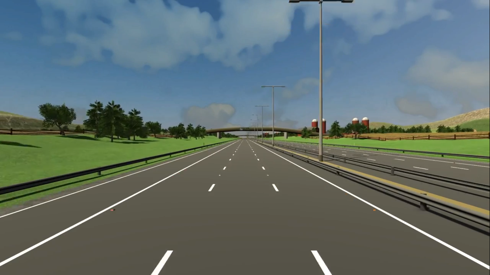
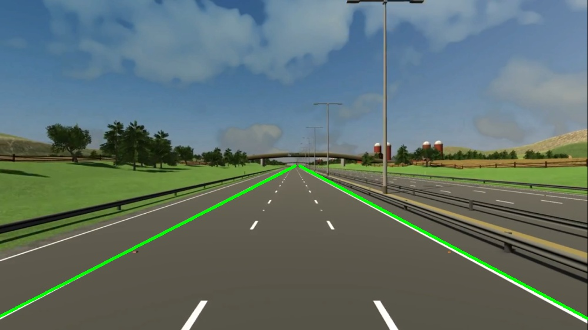

# Lanedetector-with-OpenCv
This project is intended to find the lane of road using Opencv.

# Motivation
It is motivated by the concept of Self driving car/vehicle. Lane detection is the basic and most essential part in the context of
self driving vehicle.

## Getting Started
To have this code running into your local machine you can just download or clone it to your machine and fire up the terminal into the same directory where this file 
is and just hit the command :


1.```python main.py ``` 
  This  will take webcam of your device as a video source.

2. ```python main.py --image image/image.png ```
  This will take image you provided and draw the lane over it
  
3. ```python main.py --video yourvideo.mp4```
  This will take video you provide and draw the lane over it
  
  ### Output
  

  
  
  ### Prerequisites
  1.``` python 3.4+```
  
  2.``` OpenCV 3+```  
  
  ### Installation
  [Python](https://www.python.org/downloads) ==>```www.python.org/downloads```
  
  Opencv ==> ```pip install opencv-python```
